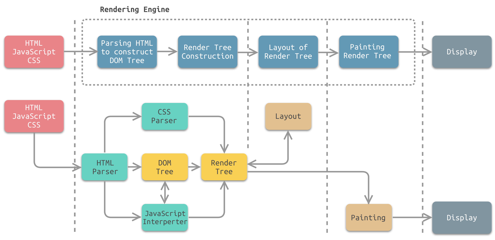

# 浏览器

## 从输入URL到页面加载的全过程

1. **DNS域名解析**：浏览器根据URL中的域名（如www.baidu.com）查找对应的IP地址（如220.114.23.56），这个过程可能涉及到浏览器缓存、本机缓存、路由器缓存、ISP DNS缓存和DNS递归查询等。
2. **TCP连接**：浏览器根据IP地址和端口号（默认为80或443）与服务器建立TCP连接，这个过程需要经过三次握手，即客户端向服务器发送SYN包，服务器回复SYN+ACK包，客户端再发送ACK包。
3. **HTTP请求**：浏览器组装一个HTTP请求报文，包含请求方法、请求头、请求体等信息，并通过TCP连接发送给服务器。
4. **HTTP响应**：服务器接收并解析HTTP请求报文，根据请求的资源和参数进行相应的处理，如查询数据库、调用后台服务等，并组装一个HTTP响应报文，包含响应状态码、响应头、响应体等信息，并通过TCP连接发送给浏览器。服务器还可以根据HTTP请求头中的缓存验证信息，判断资源是否过期，如果没有过期，可以直接返回304状态码，告诉浏览器使用缓存。
5. **TCP断开**：浏览器接收并解析HTTP响应报文，根据情况选择关闭或保留TCP连接。如果关闭TCP连接，需要经过四次挥手，即客户端向服务器发送FIN包，服务器回复ACK包，服务器再发送FIN包，客户端回复ACK包。
6. **页面渲染**：浏览器对响应报文中的资源进行解码（如gzip压缩）、解析（如HTML、CSS、JS）和渲染（如构建DOM树、CSSOM树、渲染树、布局、绘制等），最终显示出页面。这个过程中可能涉及到外部资源的下载、缓存、执行等操作，以及DOMContentLoaded和load事件的触发等。

涉及到的协议主要有以下几种：

- **DNS协议**：这个协议是用于将域名解析为IP地址的，它基于UDP协议，使用53端口。DNS协议有一个层级结构，从根域名服务器到顶级域名服务器再到权威域名服务器，最终找到对应的IP地址。
- **HTTP协议**：这个协议是用于客户端和服务器之间的通信的，它基于TCP协议，使用80端口（HTTPS使用443端口）。HTTP协议有一个请求-响应的模式，客户端发送一个HTTP请求报文，服务器返回一个HTTP响应报文。HTTP协议有多个版本，如HTTP/1.0、HTTP/1.1和HTTP/2，它们有不同的特性和优化。
- **TCP协议**：这个协议是用于在网络层之上提供可靠的、面向连接的、字节流的传输服务的，它使用三次握手和四次挥手来建立和断开连接。TCP协议有一些重要的特性，如滑动窗口、拥塞控制、流量控制、重传机制等。
- **IP协议**：这个协议是用于在网络层提供无连接的、不可靠的、基于数据报的传输服务的，它使用IP地址来标识网络中的每个设备。IP协议有两个版本，IPv4和IPv6，它们有不同的地址空间和格式。
- **其他协议**：除了上述主要的协议外，还有一些其他的协议可能涉及到浏览器输入URL到显示页面的过程，如ARP协议（用于将IP地址映射为MAC地址）、ICMP协议（用于网络诊断和错误报告）、SSL/TLS协议（用于在HTTP之上提供加密和认证服务）等。

## 浏览器的主要功能

> 浏览器是连接用户和网站之间的桥梁

1. 提供用户界面：浏览器提供了一个用户界面，使得用户可以在浏览器中输入网址、访问网站、查看网页内容等。

2. 显示网页：浏览器可以将HTML、CSS和JavaScript等网页技术转换成可视化的网页。

3. 解析HTML和CSS：浏览器可以解析HTML和CSS代码，并根据这些代码渲染网页。

4. 执行JavaScript代码：浏览器可以执行JavaScript代码，并在网页上实现交互效果。

5. 提供插件支持：浏览器可以通过插件（如Flash、Java等）来扩展其功能。

6. 支持网络通信：浏览器可以通过HTTP协议向服务器请求数据，以及通过其他协议（如WebSocket）实现实时通信。

7. 提供调试工具：浏览器提供了一些开发者工具，如控制台、调试器、网络面板等，以帮助开发人员调试和优化网页。

8. 支持离线存储：浏览器支持HTML5提供的离线存储技术，如Web Storage、IndexedDB、Service Worker等，使得网页可以在离线状态下使用。

## 浏览器的工作原理

> 浏览器是一个复杂的软件系统，其工作原理涉及多个方面，包括网络通信、文档解析、页面渲染、JavaScript引擎等。

1. 解析URL：浏览器根据用户输入的URL（统一资源定位符）解析出主机名、协议、路径等信息。

2. 发送HTTP请求：浏览器向服务器发送HTTP请求，请求网页的HTML、CSS、JavaScript等资源。

3. 接收响应：服务器收到请求后，将相应的网页资源返回给浏览器，浏览器根据服务器返回的响应状态码判断请求是否成功。

4. 解析HTML、CSS和JavaScript：浏览器将服务器返回的HTML、CSS和JavaScript等资源解析成DOM树、CSSOM树和JavaScript引擎可执行的代码。

5. 渲染页面：浏览器将DOM树和CSSOM树合并成渲染树，并根据渲染树的结构和样式信息进行布局和绘制，最终将渲染结果显示在屏幕上。

6. 处理用户事件：当用户在页面上进行交互时，浏览器会根据事件类型触发相应的事件处理程序，并执行JavaScript代码实现交互效果。

7. 执行JavaScript代码：浏览器在渲染页面的同时，也会执行JavaScript代码，实现动态效果和逻辑交互。

8. 提供开发者工具：浏览器还提供了一系列开发者工具，如控制台、调试器、性能分析工具等，帮助开发者调试和优化网页。

## 浏览器的主要组成部分

1. 用户界面（User Interface）：包括地址栏、前进/后退按钮、书签菜单等，用于与用户交互。

2. 浏览器引擎（Browser Engine）：用于处理用户界面和渲染引擎之间的交互。

3. 渲染引擎（Rendering Engine）：用于解析HTML和CSS，并将其渲染成可视化的网页。

4. JavaScript解释器（JavaScript Interpreter）：用于解释执行JavaScript代码。

5. 数据存储（Data Storage）：包括浏览器缓存、Cookies、本地存储等，用于存储用户的历史记录、缓存的数据等。

6. 网络组件（Networking）：用于处理HTTP请求、响应等网络相关的操作。

除此之外，还有一些插件和扩展可以用于增强浏览器的功能，如广告拦截器、开发者工具等。

## 浏览器架构

浏览器架构模式通常分为两种：单进程架构和多进程架构。

1. 单进程架构

单进程架构是浏览器的最初设计方式，它将所有的浏览器功能都运行在一个进程中。这种架构的好处是简单、轻量，但是它也有很明显的缺点。比如，当一个标签页崩溃时，整个浏览器都会崩溃；当一个页面执行复杂的
JavaScript 代码时，整个浏览器的响应性能也会受到影响。

2. 多进程架构

多进程架构是一种现代化的浏览器架构，它将不同的浏览器功能分配到不同的进程中运行，进程之间通过进程间通信（IPC）机制进行通信和数据交换。
这种架构的好处在于提高了浏览器的稳定性和安全性，同时也能更好地利用多核处理器的性能优势，缺点是需要更多的资源开销。

> Chrome 浏览器采用的就是多进程架构，它将每个标签页作为一个独立的进程运行，这样就可以隔离不同标签页的运行环境，提高浏览器的稳定性和安全性。

在多进程架构下，浏览器主要包括以下进程：

1. 主进程（Browser Process）：负责管理所有进程和协调它们之间的通信，还负责处理用户界面、文件访问、网络请求等任务。

2. 渲染进程（Renderer Process）：每个标签页对应一个渲染进程，负责处理当前页面的 HTML、CSS、JavaScript 等代码，构建 DOM 树、CSSOM 树、渲染树，最终将页面呈现到用户界面上。渲染进程之间相互隔离，避免了一个页面的崩溃影响其他页面。

3. 插件进程（Plugin Process）：负责运行浏览器插件，如 Flash、PDF 阅读器等。

4. GPU 进程（GPU Process）：负责处理浏览器中的 GPU 相关任务，如 3D 绘图、视频播放等。

5. 网络进程（Network Process）：负责处理网络请求和资源下载任务。

6. 存储进程（Storage Process）：负责处理浏览器数据存储相关任务，如 LocalStorage、IndexedDB 等。

多进程架构的优势主要有：

1. 稳定性：多进程架构可以避免一个标签页的崩溃导致整个浏览器的崩溃，提高了浏览器的稳定性。

2. 安全性：不同进程之间相互隔离，可以避免恶意代码的攻击和用户数据的泄露等安全问题。

3. 性能：多进程架构可以利用多核 CPU，提高浏览器的性能和响应速度。同时，不同标签页的渲染进程之间可以并行处理，避免了一个标签页的卡顿影响其他标签页的情况。

## 浏览器渲染UI的过程

1. 构建DOM树：浏览器从HTML文件中解析出所有的标签，并根据它们的嵌套关系构建一棵DOM树。

2. 构建CSSOM树：浏览器解析CSS文件，计算出每个元素应该应用的样式，并根据它们的层叠关系构建一棵CSSOM树。

3. 将DOM树和CSSOM树合并成一棵渲染树：这棵树只包含需要显示的元素，并考虑了它们的样式和层叠关系。

4. 布局：浏览器根据渲染树中每个元素的大小、位置等属性计算出它们在屏幕上的确切位置，并生成布局信息。

5. 绘制：浏览器根据布局信息将渲染树中的每个元素绘制到屏幕上，形成最终的UI界面。

需要注意的是，这些步骤并不是严格按照顺序执行的，它们可能会相互交错或重叠。而且，这些步骤的具体实现方式也可能因浏览器厂商、版本、操作系统等因素而有所不同。

## DOM Tree

在浏览器渲染页面时，会将HTML文档解析成DOM树，DOM树是由一系列节点（Node）和对象组成的层次结构，它表示了文档的结构和内容，浏览器利用DOM树来渲染网页。

DOM树的构建是一个逐步解析的过程，主要步骤如下：

1. 浏览器从网络或本地缓存中获取HTML文件，并通过标记解析器（Tokenizer）将HTML文件解析成一个个标记（Token）。

2. 标记解析器将解析得到的标记（Token）按照一定的规则（如HTML规范）转化为DOM节点（Node），并将这些节点组成一棵树状结构。

3. 根据DOM节点之间的关系，构建一棵完整的DOM树。

DOM树中的节点类型有多种，包括元素节点、文本节点、注释节点、文档节点等。每个节点都有对应的属性和方法，例如元素节点有tagName、childNodes等属性，以及appendChild、removeChild等方法。

需要注意的是，在构建DOM树时，浏览器会执行一些额外的操作，例如处理样式和脚本、创建匿名节点等，这些操作可能会对DOM树的构建产生影响。因此，为了提高页面性能，我们应该尽量减少DOM树的深度和宽度，避免不必要的节点和属性，以及使用合适的HTML结构和CSS布局来优化页面结构。

## 浏览器重绘与重排

浏览器渲染页面时，会经历以下几个步骤：解析 HTML、构建 DOM 树、构建 CSSOM 树、合并 DOM 树和 CSSOM 树形成渲染树、布局（Layout）和绘制（Painting）。

在渲染页面时，浏览器需要测量元素在屏幕上的位置和大小，以便正确地显示它们。这个过程需要进行重排（reflow）和重绘（repaint）操作。

重排指的是计算页面中每个元素的大小和位置，以及它们在页面中的相对位置。当浏览器需要重排一个元素时，它会遍历整个渲染树，计算每个元素的位置和大小，然后确定它们的排列方式。由于整个页面的元素都相互关联，因此一次重排可能会导致整个页面的重排。

重绘指的是当元素的样式改变时，浏览器需要重新绘制它们。当浏览器需要重绘一个元素时，它会重新绘制该元素的背景、边框和内容。

因为重排和重绘需要重新计算页面元素的位置和大小，所以它们是非常耗费资源的操作。为了提高网站的性能，我们应该尽量减少页面中的重排和重绘操作。

下面是一些减少重排和重绘的技巧：

1. 使用 CSS3 动画代替 JavaScript 动画；
2. 将样式应用于类而不是具体的元素；
3. 将多次改变样式的操作合并成一次操作；
4. 使用缓存，避免重复计算；
5. 对于动态添加的元素，使用 documentFragment 一次性添加，避免多次重排。

需要注意的是，尽管重排和重绘可能会影响性能，但在某些情况下它们是必须的。例如，当用户滚动页面时，浏览器需要根据需要显示的元素计算其位置，这可能会导致重排和重绘。

『重绘』不一定会出现『重排』，『重排』必然会出现『重绘』
当页面的某个元素发生重排时，浏览器会将该元素及其子元素全部重新绘制，即发生重绘。但是，当页面的某个元素只发生重绘时，不会引起重排。

重排和重绘会对页面性能产生负面影响，因此需要尽可能地避免它们。以下是一些常见的优化技巧：

1. 避免使用table进行布局，因为table的渲染需要大量的计算，容易导致页面重排。

2. 使用CSS3中的transform属性来代替position和top/left等属性进行动画效果的实现，因为transform的变换不会影响到页面的布局，只会影响到元素的绘制。

3. 避免使用JavaScript频繁地操作DOM，尽可能地一次性修改多个元素的样式，可以通过在内存中构建DOM节点进行批量操作，最后再统一地将它们添加到文档中。

4. 使用CSS Sprites技术来减少页面中图片的请求次数，将多个图片合并到一张图片中，通过CSS的background-position属性来设置不同的图片位置。

5. 使用CSS中的position:fixed属性来固定元素的位置，因为fixed定位的元素不会随页面滚动而重排。

6. 将需要频繁操作的元素设置为position:absolute或position:fixed，这样它们不会影响到文档流，也就不会触发重排。

7. 避免使用table布局，table布局的特性会导致当某个单元格内容变化时，整个table都会重新渲染，容易引起大量的重排和重绘。

8. 避免使用CSS表达式，因为它会在页面每次重绘时重新计算，会对性能产生很大的影响。

9. 合理使用合成层，可以有效减少重绘和重排的次数，提升合成层的最好方式是使用 CSS 的 will-change 属性

总之，避免过多的DOM操作和频繁的样式变换，可以显著地提高页面的性能。

## 合成层

合成层（Compositing Layer）是指在浏览器的渲染过程中，将某些需要独立处理的元素单独绘制到一个层中，形成一个独立的图层，再将这些图层合并成最终的画面。

通过使用合成层，可以有效减少重绘和重排的次数，提高页面的性能。常见的使用场景包括：

1. 动画元素：如CSS3的transform、opacity、filter等属性，可以将元素单独绘制到一个合成层中，使得动画的过程中只需重绘合成层，而不影响其他元素的渲染。

2. 视频、canvas、iframe等元素：这些元素的渲染需要单独处理，如果不使用合成层，会导致整个页面的重排和重绘。

3. Fixed定位元素：由于Fixed定位元素不随页面滚动而移动，因此可以将它们单独绘制到一个合成层中，避免页面滚动时的重排和重绘。

在使用合成层时，需要注意以下几点：

1. 创建过多的合成层会占用大量的内存资源，导致页面变慢，因此需要合理使用。

2. 合成层的创建和销毁会有一定的性能消耗，因此需要根据实际情况进行权衡和优化。

3. 合成层的大小和内容应该尽可能小，避免过度消耗内存和GPU资源。

## 进程、线程和协程

进程、线程和协程都是计算机中的并发执行模型。

进程是操作系统中资源分配的基本单位，每个进程都有独立的内存空间、代码、数据、文件描述符等，进程之间通信需要通过操作系统提供的进程间通信（IPC）机制。

线程是进程中的执行单元，同一个进程中的多个线程共享进程的内存空间，每个线程有自己的栈、寄存器和程序计数器，线程之间可以通过共享内存和消息传递的方式进行通信。

协程是一种用户态的轻量级线程，也被称为纤程或协作式多任务处理。协程不依赖于操作系统内核线程，而是由用户态线程库实现，因此创建和切换开销很小。协程之间通过协作式的方式交换控制权，也就是说一个协程执行一段时间后主动让出控制权，让另一个协程执行。

它们之间的联系和区别如下：

联系：

- 进程、线程、协程都是计算机中的并发执行模型。
- 进程、线程、协程都可以通过消息传递的方式进行通信。

区别：

- 进程是资源分配的基本单位，线程是执行的基本单位，协程是用户态的轻量级线程。
- 进程之间需要通过操作系统提供的IPC机制进行通信，线程之间可以通过共享内存或消息传递进行通信，协程之间通过协作式的方式交换控制权。
- 进程、线程之间切换的开销较大，需要由操作系统进行调度，协程切换开销较小，可以由用户态线程库实现。
- 进程之间互相独立，拥有自己的内存空间，线程共享进程的内存空间，协程也可以共享内存空间，但通常采用栈保存协程状态，因此每个协程有自己的执行栈。

## 进程间的通信方式

进程间通信（Inter-Process Communication，IPC）是指在多进程环境下，进程之间进行数据交换和共享资源的机制和方法。常见的进程间通信方式包括：

1. 管道（Pipe）：管道是一种半双工的通信方式，只能实现单向数据传输，需要在两个进程之间建立一个通信管道，一个进程写入数据，另一个进程从管道读取数据。

2. 命名管道（Named Pipe）：命名管道也是一种半双工的通信方式，与管道不同的是，命名管道在文件系统中有一个唯一的名字，可以在不同的进程之间进行通信。

3. 信号（Signal）：信号是一种异步的通信方式，可以用来通知进程发生了某个事件，例如进程终止、用户按下了某个键等。

4. 消息队列（Message Queue）：消息队列是一种面向消息的通信方式，进程可以向队列中写入消息，也可以从队列中读取消息。

5. 共享内存（Shared Memory）：共享内存是一种高效的通信方式，可以让多个进程访问同一块物理内存，从而避免数据的复制和传输。

6. 套接字（Socket）：套接字是一种面向网络的通信方式，可以用于在本地或远程主机之间进行进程间通信。

这些进程间通信方式各有优缺点，在不同的应用场景中使用。例如，管道和命名管道适用于单向数据传输；信号适用于通知进程发生某个事件；消息队列适用于进程间异步通信；共享内存适用于高效的数据共享；套接字适用于网络通信等。

## 浏览器样式兼容

1. 使用浏览器前缀：一些新的 CSS 属性或值可能只在某些浏览器中支持，这时可以使用浏览器前缀来指定不同浏览器对应的属性值，例如 `-webkit-`、`-moz-`、`-o-`、`-ms-` 等。

2. 使用 CSS Hack：CSS Hack 是一些特殊的 CSS 代码，用于在不同浏览器中识别不同的 CSS 属性或值，从而实现样式兼容性处理。但是 CSS Hack 的使用会使代码变得冗余且难以维护，因此不建议在项目中大量使用。

3. 使用 CSS Reset：不同的浏览器对默认样式的处理方式不同，因此可以使用 CSS Reset 来统一浏览器之间的默认样式，从而减少兼容性问题。

4. 使用 CSS Framework：一些 CSS Framework（如 Bootstrap、Foundation 等）提供了统一的样式和组件，可以避免兼容性问题，同时也提高了开发效率。

## JS垃圾回收机制

JavaScript中的垃圾回收机制是指自动监测对象是否不再被引用，并自动释放不再被引用的对象所占用的内存空间的一种机制。

JavaScript垃圾回收机制的具体实现方法有两种：

1. 标记清除法（Mark-and-Sweep）

JavaScript引擎会在内部维护一个根对象列表，根对象可以看作是全局对象以及当前调用堆栈中的对象。引擎定期从根对象开始，遍历所有对象，将其标记为活动对象（即仍被引用），然后清除所有未被标记的对象（即不再被引用的对象），释放它们占用的内存空间。

2. 引用计数法（Reference Counting）

JavaScript引擎会在每个对象上维护一个引用计数器，记录当前有多少个对象引用了该对象。当引用计数器为0时，即表示该对象不再被引用，此时JavaScript引擎会立即释放其占用的内存空间。

但是，引用计数法会存在循环引用的问题，即两个对象相互引用，导致引用计数器无法归零，这些对象将一直存在内存中，无法被回收。因此，现代JavaScript引擎主要采用标记清除法来实现垃圾回收机制。

## 内存泄漏

在计算机科学中，内存泄漏（Memory Leak）指程序在申请内存后，无法释放已申请的内存空间，导致系统的可用内存不断减小，程序运行速度不断减慢甚至崩溃的现象。

在JavaScript中，内存泄漏通常指不再使用的内存仍然被占用，导致浏览器或Node.js的内存占用不断增加，最终导致性能问题或崩溃。

常见的内存泄漏情况包括：

1. 全局变量：在全局作用域定义的变量，会一直存在于内存中，直到页面关闭或JavaScript代码被移除。

2. 闭包：如果一个函数持有对外部变量的引用，而这个函数又被其他函数或全局变量持有引用，那么这个外部变量会一直存在于内存中，即使函数已经执行完毕。

3. DOM元素的引用：如果页面中的DOM元素被保存在JavaScript对象中，而这个JavaScript对象又被其他对象所引用，那么这个DOM元素就不会被垃圾回收器回收。

4. 定时器：如果设置了定时器但未清除，即使定时器已经不再需要，它也会一直存在于内存中，直到页面关闭。

为了避免内存泄漏，可以采取以下几个措施：

1. 减少全局变量的使用，尽量将变量封装在局部作用域中。

2. 确保函数内部局部变量不会无意中引用全局变量。

3. 及时清除不再使用的DOM元素引用或事件监听器。

4. 及时清除不再需要的定时器和interval。

5. 使用JavaScript垃圾回收机制，不要手动进行内存管理，避免出现内存泄漏和性能问题。

