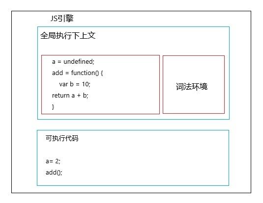
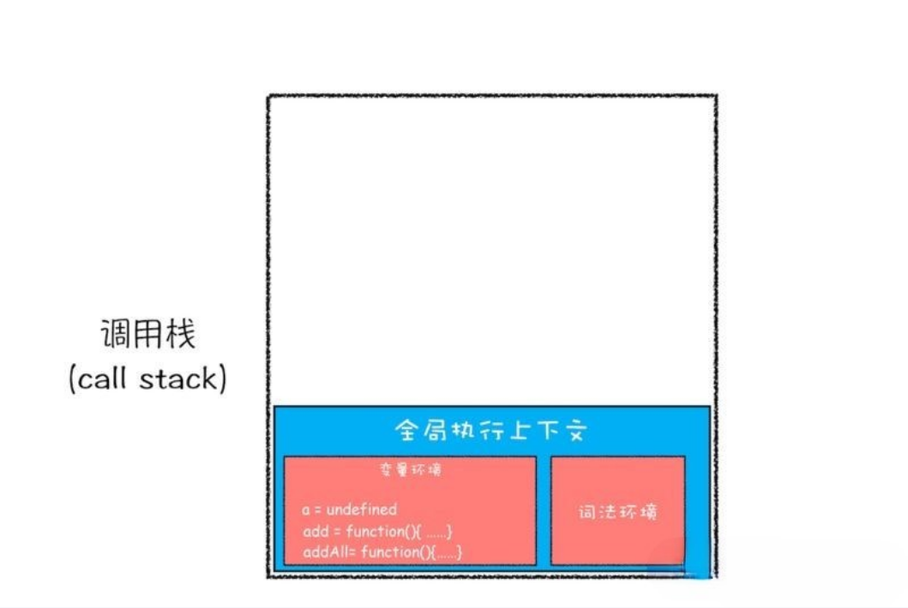
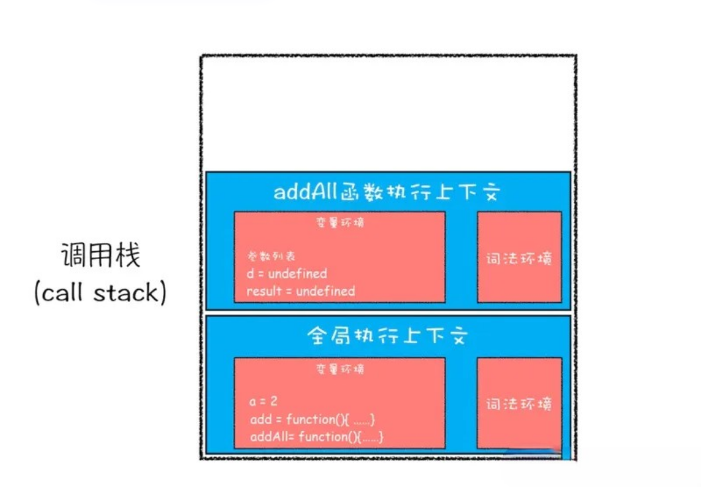
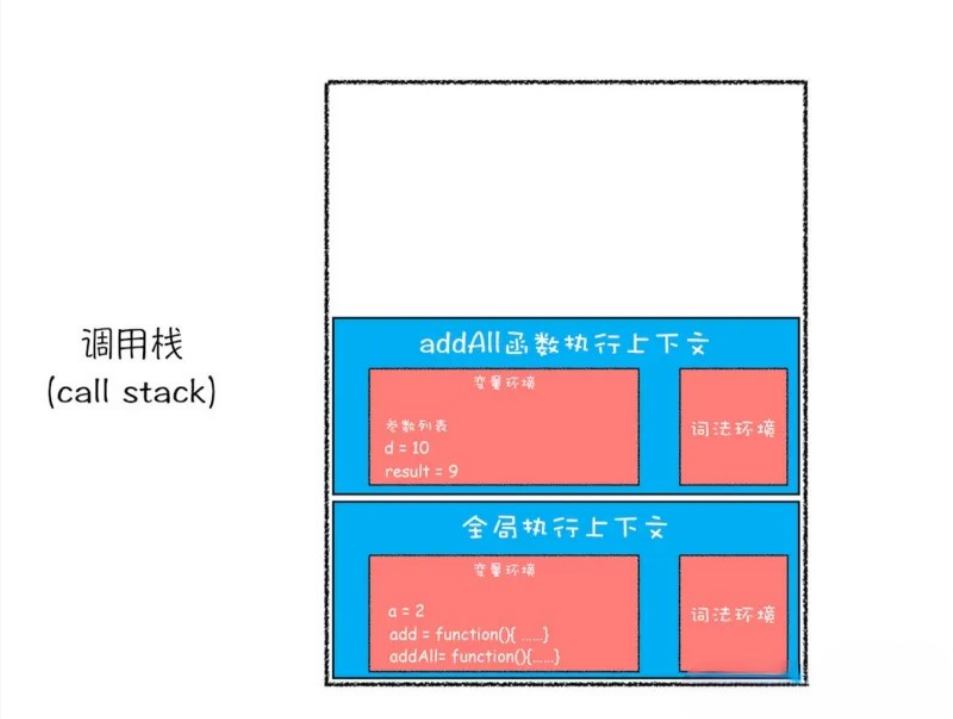
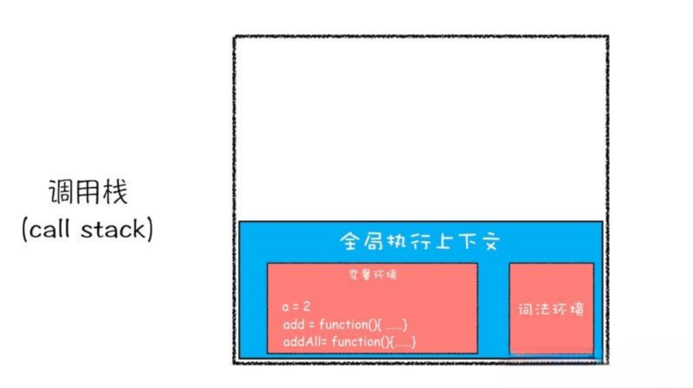
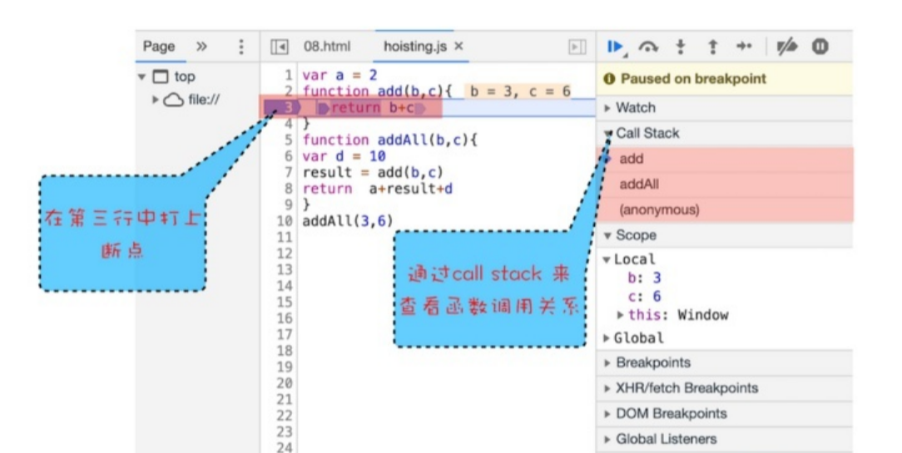

# 调用栈 CallStack

函数是 `JS` 中的最高公民，**调用栈**就是用来管理函数调用关系的一种 **数据结构**。

## 函数调用

```js
var a = 2;

function add() {
  var b = 10;
  return a + b;
}

add();
```

* 编译阶段

编译结束后会生成：**全局执行上下文** 和 **可执行代码**



* 执行阶段

生成可执行代码之后，`JS` 引擎开始顺序执行代码，执行到 `add` 这里时，`JS` 引擎判断出这里是函数调用，然后执行下面操作：

1. 从全局上下文中取出 `add` 函数代码

2. 对 `add` 函数的这段代码进行编译（创建函数的执行上下文环境和可执行代码）

3. 执行 `add` 函数，输出结果


函数调用完毕，在执行 `add` 函数时，会存在两个执行上下文，一个是全局执行上下文，一个是 `add` 函数的执行上下文。
那么 `JS` 引擎是怎么管理多个执行上下文的呢？`JS` 引擎是通过栈来管理这些执行上下文的。

## 栈

栈是一种数据呈**线性排列**的数据结构，特点是 **先进后出**。


## 调用栈

管理执行上下文的栈，就叫调用栈。每次创建好一个执行上下文之后，就会放入调用栈中。

```js
var a = 2

function add(b, c) {
  return b + c
}

function addAll(b, c) {
  var d = 10
  var result = add(b, c)
  return a + result + d
}

addAll(3, 6)
```

上面代码中，在 `addAll` 函数中调用了 `add` 函数，现在逐步分析调用栈如何变化

* 第一步，创建全局执行上下文，并将其压入栈底。变量 `a`、函数 `add`、函数 `addAll` 都保存到 `全局执行上下文` 的变量环境对象中。如下图：



* 第二步，执行上下文环境压入调用栈之后，`JS` 引擎开始执行全局代码：

执行 `a = 2;` 该语句会将全局执行上下文变量环境中 `a` 的值设置为 `2`。全局执行上下文环境状态如下图：


* 第三步，执行 `addAll(3, 6)` 调用 `addAll` 函数时：

`JS` 引擎会编译 `addAll` 函数，并为 `addAll` 创建一个 `执行上下文`，最后将 `addAll` 函数的执行上下文环境压入栈中，如下图：



* 第四步，`addAll` 函数的执行上下文创建成功之后，接着执行 `addAll` 函数的可执行代码：

```js
d = 10
result = add(b, c)
return a + result + d
```

* 第五步，执行到 `add` 函数调用语句时，同样会为 `add` 函数创建一个执行上下文环境，并将其压入调用栈，如图所示：


* 第六步，创建好 `add` 函数的执行上下文环境之后，接着执行 `add` 函数的可执行代码 `return b + c;`。

`add` 函数返回时，`add` 函数的执行上下文环境就会从调用栈顶部弹出，并将 `result` 的值设置为 `add` 函数的返回值 `9`，如下图：



* 第六步，执行 `addAll` 函数中接下来可执行代码 `return a + result + d;`

这个语句执行完成之后，把结果返回，`addAll` 函数的执行上下文环境也会从调用栈顶部弹出，此时调用栈中就只剩下全局执行上下文了。至此，整个 `JS` 流程执行结束，如下图所示：



`JS` 调用栈是 `JS` 引擎追踪函数执行的一个机制，当一次有多个函数被调用时，通过调用栈就能够追踪到哪个函数正在被执行以及各个函数之间的调用关系。


## 浏览器中查看堆栈



右边的 `CallStack` 下面显示出了函数的调用关系：
栈的底部是 `anonymous`，也就是全局的函数入口；中间是 `addAll` 函数，顶部是 `add` 函数。非常清晰的反映了函数的调用关系。在分析复杂的代码时，调用栈是非常有用的。

## console.trace()

也可以在代码中添加 `console.trace()` 来输出函数的调用关系，如在 `add` 函数中增加 `console.trace()` ，如下图：


## 栈溢出

调用栈是用来管理执行上下文的数据结构，先进后出。需要注意的是，他是有大小的，当入栈的执行上下文超过一定输入，`JS` 引擎就会报错，这种错误就叫做 **栈溢出**。

---
递归函数，很容易出现栈溢出，如下代码，当执行时就会出现栈溢出情况
```js
function add(a, b) {
  return add(a, b)
}

add(1, 2)
```

分析：当 `JS` 引擎开始执行 `add` 函数时，就会为 `add` 函数创建执行上下文环境压入调用栈中，但是这个函数是递归的并且没有终止条件，所以 `JS` 引擎会一直创建新的函数执行上下文，并反复将其压入调用栈中，当超过调用栈的最大限度之后，就会出现栈溢出错误。


