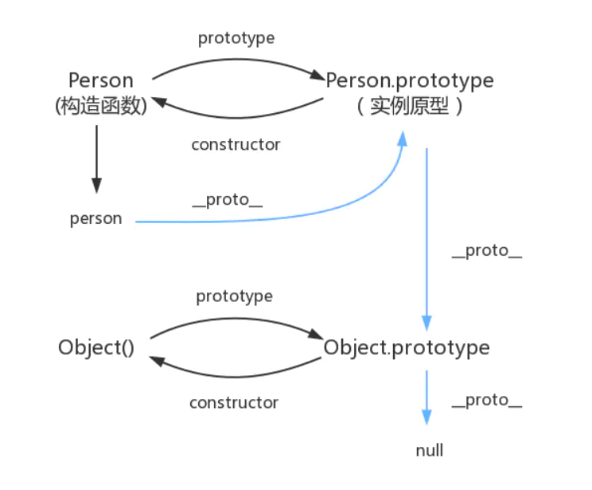

# 原型链

## 原型对象

* `JS` 的每个函数（`Person`）在创建的时候，都会生成一个 `prototype` 属性，这个属性指向一个对象，这个对象就是此函数的原型对象（`Person.prototype`）。

* 每一个对象（包括普通对象、实例、`prototype`）都有一个 `__proto__` 属性，这个属性指向该对象的构造函数的原型对象（`Person.prototype`）。

* 原型对象（`Person.prototype`）中有个 `constructor` 属性，这个属性指向该构造函数。这样原型对象和它的构造函数之间就产生了联系。

## 原型链

当我们访问一个 `对象` 的属性或者方法的时候，会先在对象自身属性上查找，有则直接使用，没有则通过他的隐式属性`person.__proto__（Person.prototype）`
上查找，如果没有找到则会在其构造函数的 `prototype` 的 `__proto__` 中查找，没有找到就再往上一层查找，直到 `Object`，这样一层一层的查找就会形成一个链式结构——**原型链**

## new

`new` 关键字会进行如下的操作：

1. 创建一个空的简单 `JavaScript` 对象（即 `{}`）；

2. 为步骤 `1` 新创建的对象添加属性 `__proto__`，将该属性链接至构造函数的原型对象；

3. 将步骤 `1` 新创建的对象作为 `this` 的上下文；

4. 如果该函数没有返回对象，则返回 `this`。
