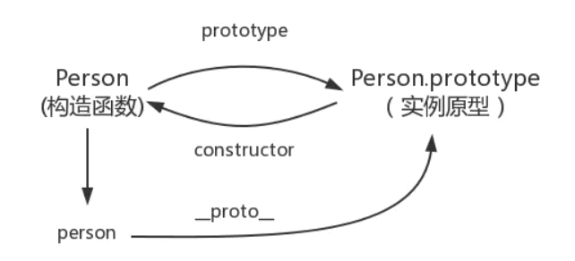
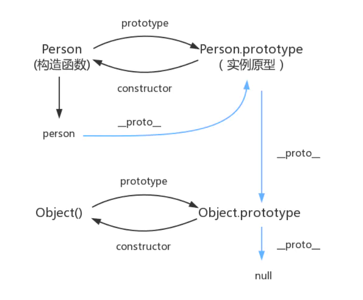

# 原型链

## 原型对象

* `JS` 的每个函数（`Person`）在创建的时候，都会生成一个 `prototype` 属性，这个属性指向一个对象，这个对象就是此函数的原型对象（`Person.prototype`）。

* 每一个对象（包括普通对象、实例、`prototype`）都有一个 `__proto__` 属性，这个属性指向该对象的构造函数的原型对象（`Person.prototype`）。

* 原型对象（`Person.prototype`）中有个 `constructor` 属性，这个属性指向该构造函数。这样原型对象和它的构造函数之间就产生了联系。



## 原型链

当我们访问一个 `对象` 的属性或者方法的时候，会先在对象自身属性上查找，有则直接使用，没有则通过他的隐式属性 `person.__proto__（Person.prototype）`
上查找，如果没有找到则会在其构造函数的 `prototype` 的 `__proto__` 中查找，没有找到就再往上一层查找，直到 `Object`，这样一层一层的查找就会形成一个链式结构——**原型链**



## new

`new` 关键字会进行如下的操作：

1. 创建一个空对象 `obj`；

2. 为 `obj` 添加原型属性 `__proto__` 链接构造函数的原型对象；

3. 将构造函数的 this 指向 `obj`；

4. 如果构造函数没有返回对象，则返回 `obj`。

```javascript
function myNew(Func: Function, ...args: any[]) {
  // 1. 创建一个空对象
  const obj = Object.create(null)
  // 2. 将构造函数原型对象指向新对象原型
  obj.__proto__ = Func.prototype
  // 3. 将构造函数的 this 指向新对象，调用构造函数
  const result = Func.apply(obj, args)
  // 4. 根据返回值判断
  return result instanceof Object ? result : obj
}
``` 
