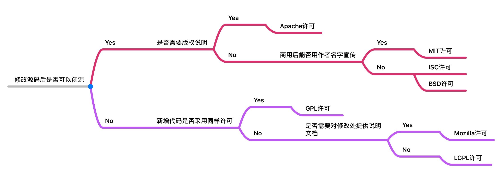

# 七种开源许可证

## Apache许可

- `Apache` 许可证(Apache License)，是一个在Apache软件基金会发布的自由软件许可证，最初为Apache
  http服务器而撰写。Apache许可证要求被授权者保留版权和放弃权利的申明，但它不是一个反版权的许可证。

- 当前版本 [Apache License, Version 2.0](https://www.apache.org/licenses/LICENSE-2.0.html)

## MIT许可

- `MIT` 许可证之名源自麻省理工学院（Massachusetts Institute of Technology, MIT），又称 `X条款`（X License）或 `X11条款`（X11
  License）。

- `MIT` 是和 `BSD` 一样宽范的许可协议，作者只想保留版权,而无任何其他了限制。也就是说，你必须在你的发行版里包含原许可协议的声明，无论你是以二进制发布的还是以源代码发布的。

- 当前版本 [The MIT License](https://opensource.org/licenses/mit-license)

## ISC许可

- `ISC` 许可证是一种开放源代码许可证，在功能上与两句版的 `BSD` 许可证相同。

- 这份许可证是由 ISC（Internet Systems Consortium）所发明，在 `ISC` 释出软件时所使用的。

- 当前版本 [ISC License (ISC)](https://opensource.org/licenses/ISC)

## BSD许可

- `BSD` 开源协议（original BSD license、FreeBSD license、Original BSD license）是一个给于使用者很大自由的协议，`BSD`
  代码鼓励代码共享，但需要尊重代码作者的著作权。

- `BSD` 由于允许使用者修改和重新发布代码，也允许使用或在 `BSD` 代码上开发商业软件发布和销售，因此是对商业集成很友好的协议。

- 当前版本 [The 3-Clause BSD License](https://opensource.org/licenses/BSD-3-Clause)

## GPL许可

- `GPL` 是 `GNU General Public License` 的缩写，是GNU通用公共授权非正式的中文翻译。它并非由自由软件基金会所发表，亦非使用GNU通用公共授权的软件的法定发布条款。

- 只有GNU通用公共授权英文原文的版本始具有此等效力。

- 当前版本 [GNU General Public License](https://opensource.org/licenses/gpl-license)

## Mozilla许可

- `MPL` 是 `The Mozilla Public License` 的简写，是1998年初Netscape的 Mozilla小组为其开源软件项目设计的软件许可证。

- `MPL` 许可证出现的最重要原因就是，Netscape 公司认为 `GPL` 许可证没有很好地平衡开发者对源代码的需求和他们利用源代码获得的利益。

- 当前版本 [Mozilla Public License 2.0](https://opensource.org/licenses/MPL-2.0)

## LGPL许可

- `LGPL` 是 `GNU Lesser General Public License` (GNU 宽通用公共许可证)
  的缩写形式，旧称 `GNU Library General Public License` (GNU 库通用公共许可证)，后来改称作 `Lesser GPL`，即为更宽松的 `GPL`
  ，在宽松程度上与 `BSD，Apache，XFree86` 许可证相似。

- 当前版本 [Lesser General Public License](https://opensource.org/licenses/lgpl-license)

## [开源代码促进会](https://opensource.org/) 